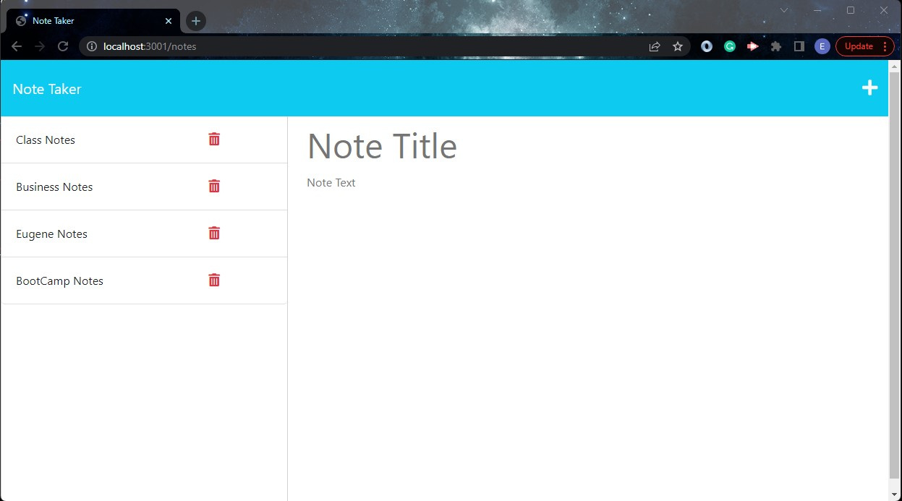

# Note-Taker

## Description

It is a note taking application that helps users to take, save, and delete notes. It allows users to take as many notes they want and it allow easy access for reference. 

## Table of Contents

* [Installation](#installation)
* [Usage](#usage)
* [License](#license)
* [Contributing](#contributing)
* [Tests](#tests)
* [Questions](#questions)

## Installation

The user needs to change directory to project folder and run the modules and packages for the application through the terminal by typing "npm install". After running the modules and packages, locate the file Server.js and right click on it to open it in intergrated terminal. Run it in the server and open a port by typing "node server.js" in the terminal. Go to the browser to to open it through the local host and designated port. eg. localhost:[port number]. The application will come up in the browser ready to be utilized. 

## Usage

It helps users to take notes, save, and delete them. First, the user will type the title and move below it to type the actual notes. Click on the save button to save the notes. Click on the + sign to add new notes or start the first step again to create a new note. click on the delete button next to the saved note to delete it.

## License

[MIT License](https://opensource.org/licenses/MIT)

## Contributing

Anyone wanting to contribut should contact me. It is a project that was created as an assignment.

## Tests

Several test has done on it and confirmed passed.

## Questions

Any questions should be directed to me via:

Github [eugenestar5](https://github.com/eugenestar5)

Below is a link to the project on Github: 

https://github.com/eugenestar5/Note-Taker.git